Here is the solution to find every required thing from linux terminal, which was related to the task, I have runned sperate commands for every question, and created the script where required.

OS/kernel identification;

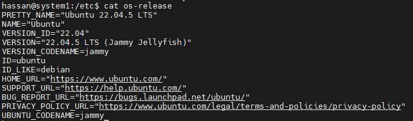

CPU, memory and disk utilization;

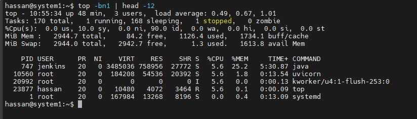

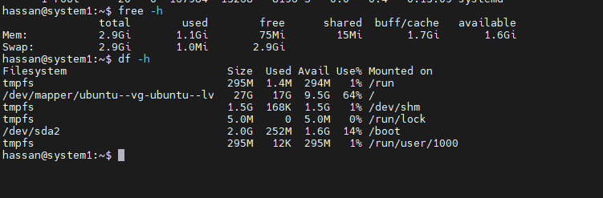

listening ports and relevant processes;

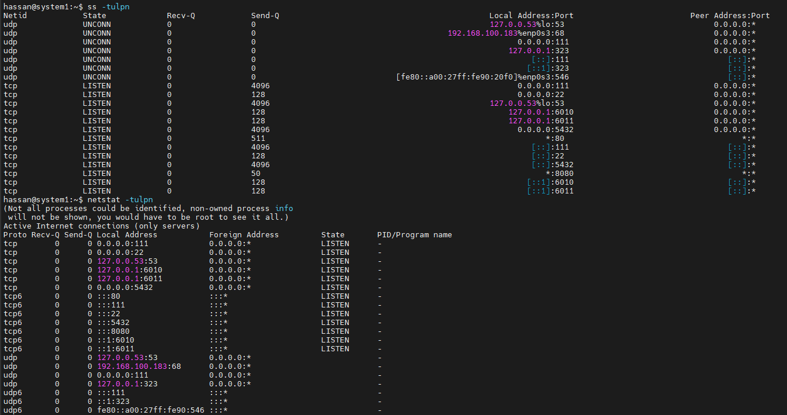

MiniPay-related processes:

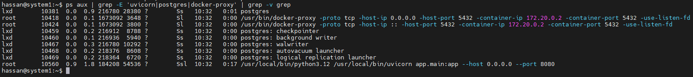

DNS/network connectivity checks;

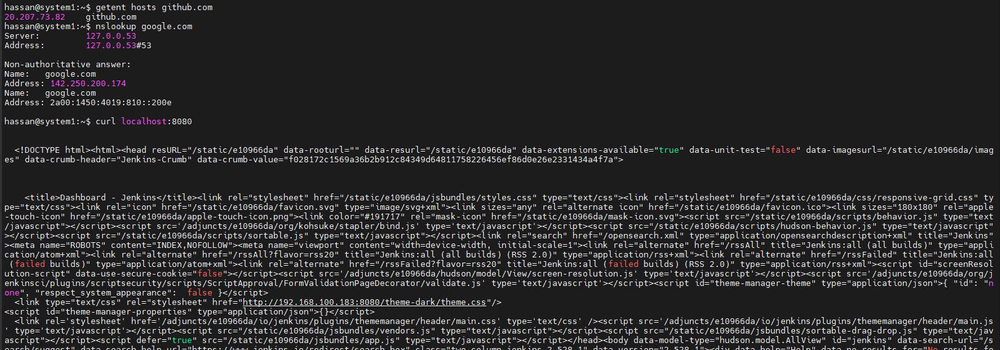

application/container logs;

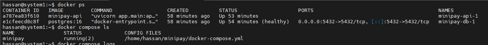

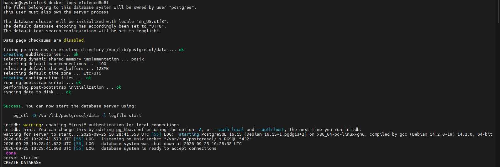

identifying the process consuming the most memory;

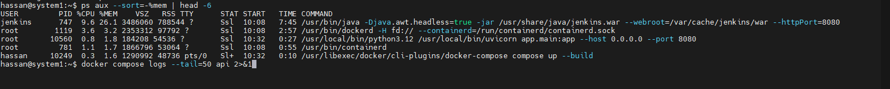

identifying disk usage by directory;

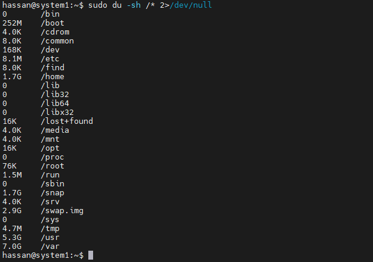

a simple repeatable health-check script.

Script:

            GNU nano 6.2                                                                                 script.sh
        echo "--------------------------------"
        free -h

        echo ""
        echo "4. DISK"
        echo "--------------------------------"
        df -h /

        echo ""
        echo "5. LISTENING PORTS"
        echo "--------------------------------"
        ss -tulpn

        echo ""
        echo "6. NETWORK"
        echo "--------------------------------"
        ip -br addr

        echo ""
        echo "DNS Test:"
        getent hosts google.com

        echo ""
        echo "Internet Test:"
        ping -c 2 8.8.8.8

        echo ""
        echo "7. TOP MEMORY USING PROCESSES"
        echo "--------------------------------"
        ps aux --sort=-%mem | head -n 6

        echo ""
        echo "8. DISK USAGE BY DIRECTORY"
        echo "--------------------------------"
        du -sh /* 2>/dev/null | sort -h

        echo ""
        echo "9. DOCKER CONTAINERS"
        echo "--------------------------------"

        if command -v docker >/dev/null 2>&1
        then
            docker ps
        else
            echo "Docker is not installed."
        fi

        echo ""
        echo "10. APPLICATION TEST"
        echo "--------------------------------"

        curl -I --max-time 5 http://localhost:8080/health

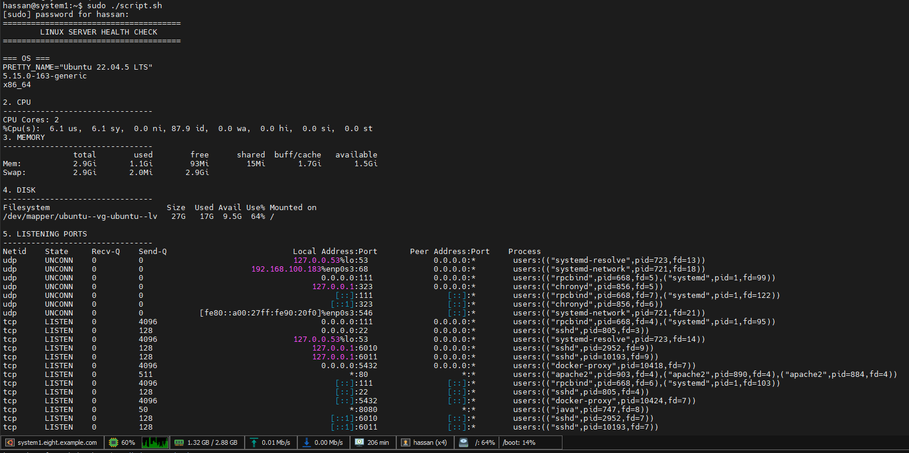